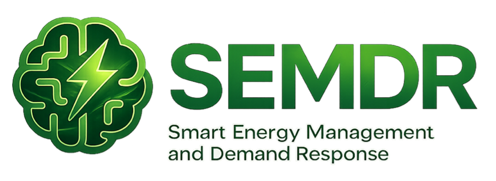
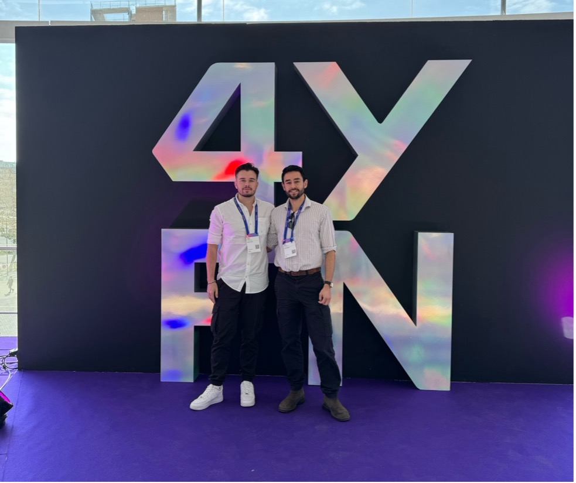
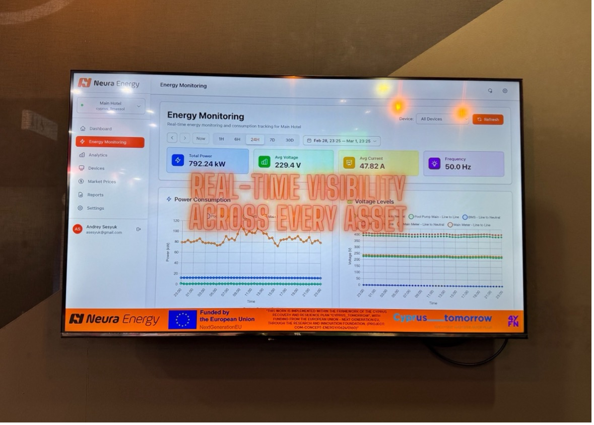
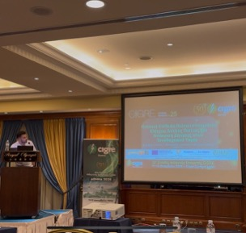
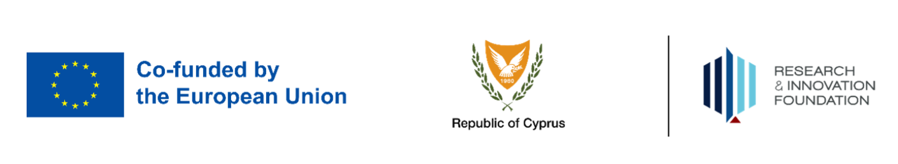

# SEMDR

## Smart Energy Management and Demand Response Capabilities for Sustainable Industry

SEMDR develops and validates an AI-driven energy management and demand response platform for the hospitality sector, piloted at Elias Beach Hotel in Limassol, Cyprus. The project targets practical, measurable reductions in hotel energy costs and peak-period electricity demand while maintaining guest comfort and operational requirements.

The work combines real-time monitoring hardware, a cloud data and analytics platform, and model-based optimisation algorithms for three use cases: pool pump duty-cycle scheduling, HVAC supervisory setpoint control, and peak-period demand shaping. Results from the 12-month project include 24.2% average cost savings on pool pump operation (verified over a 58-day production window), 10.9% projected HVAC energy savings validated against a site-calibrated thermal model, and 99.9% platform uptime across the monitored period.

**Funding Body:** [Research and Innovation Foundation of Cyprus](https://research.org.cy/)

**Programme:** RESTART 2016–2020

**Project Code:** COM-CONCEPT-ENERGY/0624/0160

**Duration:** 1 April 2025 – 31 March 2026 (12 months)

**Host Organisation:** [IMKA Holdings Ltd](https://www.imkacy.com/)

**Partners:** [GridQ Ltd (Neura Energy)](https://neura.energy) · Restrol

**Pilot Site:** Elias Beach Hotel, Limassol, Cyprus

### Consortium

**IMKA Holdings Ltd (Host Organisation)**
Dr Andrey Sesyuk, Karim Arnous, Marinos Antoniou, Matthew Faghiri

**GridQ Ltd / Neura Energy (Partner 1)**
Dr Andreas Procopiou, Antonis Antoniou

**Restrol (Partner 2)**
Giorgos Masourekkos

---

## News

#### March 2026 — Project completion
The 12-month SEMDR project completed on 31 March 2026, with all 15 defined key performance indicators met or exceeded.

#### 24 March 2026 — SEMDR Stakeholder Webinar
Online webinar delivered via Google Meet to stakeholders from the hospitality industry, the energy sector, and the research community. Presented by Dr Andrey Sesyuk and Karim Arnous (IMKA) and Dr Andreas Procopiou (GridQ). The webinar covered the Cyprus energy context, the SEMDR system architecture, the pilot deployment, and validated results for both the pool pump and HVAC use cases. Promoted via LinkedIn and covered in an article on CyprusEnergyNews: [SEMDR — Smart Chiller Optimization in Cyprus Hotels](https://www.cyprusenergy.news/post/semdr-smart-chiller-optimization-cyprus-hotels).

#### March 2026 — Pool pump optimisation
The pool pump optimisation algorithm has been running continuously and autonomously at the pilot site since its promotion to production in November 2025. 

#### 2–5 March 2026 — 4YFN AI & Start-up Conference, Barcelona
The consortium presented SEMDR at the Cyprus National Booth at the 4YFN conference in Barcelona, alongside the RIF delegation. The SEMDR project dashboard was displayed on the RIF booth screens throughout the event.

#### January 2026 — HVAC supervisory control validated against Elias Digital Twin
The HVAC supervisory control algorithm has been validated against a custom thermal model of the pilot site, calibrated using real data collected from the hotel's building management system during the cooling season.

#### 12 December 2025 — SEMDR results presented at CIGRE 2025, Athens
Dr Andrey Sesyuk (Project Coordinator) presented the consortium paper *"Real-World Demonstration of Optimized Pool Pump Control for Demand Response in the Hospitality Sector"* at the 32nd Scientific Conference of EU CIGRE in Athens, Greece.

#### November 2025 — Pool pump optimisation promoted to production
After passing all promotion gates during supervised shadow-mode and controlled-activation trials, the system was promoted to continuous autonomous operation at pilot site.

#### October 2025 — Building Management System upgrade completed
The vendor-approved upgrade to Elias Beach Hotel's BMS was completed, enabling access for both read and write operations. Live chiller operational data were collected under this integration. This BMS data was subsequently used to calibrate the Elias Digital Twin thermal model. The same month, integration with Cyprus day-ahead electricity market prices from TSOC went live, enabling tariff-aware scheduling for both the pool pump and HVAC algorithms.

#### August 2025 — Field installation complete; continuous telemetry live
Continuous telemetry went live across the hotel mains, the pool pump circuit, the refrigeration board, and the lobby environment. All edge devices communicate with the cloud. The mesh network providing on-site connectivity was also commissioned and handed over.

#### June 2025 — Project website launched
The SEMDR project website launched at [https://semdrcy.replit.app](https://semdrcy.replit.app), providing a public access point for project information, news, and partner profiles.

#### May 2025 — Architecture workshop
All three consortium partners met to finalise the end-to-end integration plan for the pilot site, covering edge hardware, the AWS cloud pipeline, the BMS integration path, and the validation methodology for each use case.

#### April 2025 — Project kick-off
The SEMDR consortium (IMKA, GridQ Ltd / Neura Energy, Restrol) kicked off the 12-month RIF RESTART project (Project Code COM-CONCEPT-ENERGY/0624/0160) at Elias Beach Hotel, Limassol. Pilot site familiarisation and first site assessment completed.

---

## Open Science Outputs

* **OS-1:** [Cyprus energy market price forecaster](https://github.com/semdr-project/cyprus-energy-market-prices-forecaster) — Day-ahead electricity price forecasting tools. MIT licence.
* **OS-2:** [Cyprus weather and electricity prices dataset](https://github.com/semdr-project/cyprus-weather-electricity-prices) — Day-ahead prices joined with Limassol weather observations. MIT (code) / CC BY 4.0 (data).
* **OS-3:** [Limassol hotel HVAC EnergyPlus baseline dataset](https://github.com/semdr-project/limassol-hotel-hvac-energyplus-dataset) — Five fixed-setpoint EnergyPlus baselines for a Mediterranean hotel. CC BY 4.0.
* **Landing page:** [semdr-open-science](https://github.com/semdr-project/semdr-open-science) — Index of all open science outputs with Zenodo DOIs.

---

## Publications

* A. Procopiou et al., *[paper title]*, CIGRE Session 2025, Athens, Greece, September 2025. Oral presentation. Proceedings forthcoming.

*(Additional publications from the project will be listed here as they appear.)*

---

## Deliverables

Deliverable reports are available upon request to the coordinator. A selection of public-facing summaries and datasets is available through the Open Science Outputs above.

---

## Contact

**Project Coordinator:** [Dr. Andrey Sesyuk](https://www.linkedin.com/in/asesyuk/) - [as@neura.energy](mailto:as@neura.energy)

---

SEMDR (Project Code: COM-CONCEPT-ENERGY/0624/0160) is funded by the Research and Innovation Foundation of Cyprus under the RESTART 2016–2020 Programmes, with support from the European Union – NextGenerationEU and the Republic of Cyprus Recovery and Resilience Plan.
